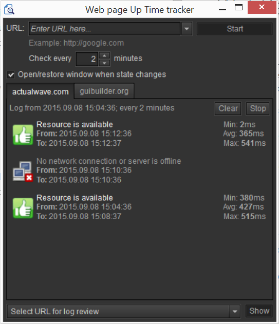
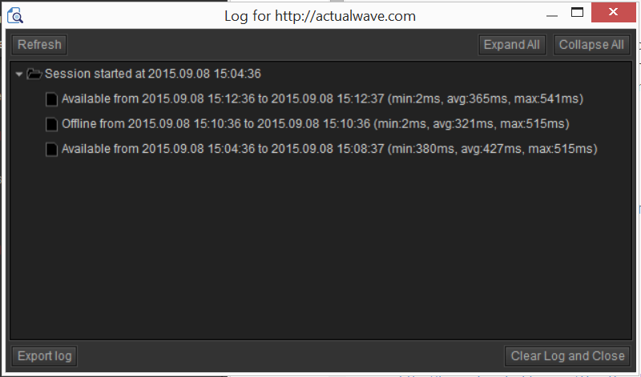

#WebPage Uptime Tracker

This is an open-source application based on  Adobe AIR runtime. It pings internet resource(send HEAD HTTP request), notifies when resource becomes available from your network. You can hide application to tray and it will flash out when resource becomes available.  

It allows to track multiple resources at a time.

And you can check detailed log for every URL you have tracked.

[Download WebPage Uptime Tracker](https://github.com/burdiuz/webpage-uptime-tracker/raw/master/WebPageUpTimeTracker.air)

[Download Adobe AIR runtime](https://get.adobe.com/air/)

####Resources used in this application
[Adobe Flex SDK 4](http://www.adobe.com/devnet/flex/flex-sdk-download.html)  
[Kingnare style](http://code.google.com/p/kingnarestyle/) -- application skin  
Icons from:  
http://www.iconfinder.com/  
http://neurovit.deviantart.com  
http://www.aha-soft.com  
http://tango.freedesktop.org/The_People  
http://www.exploding-boy.com  

> Written with [StackEdit](https://stackedit.io/).